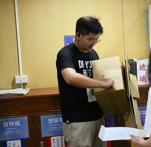
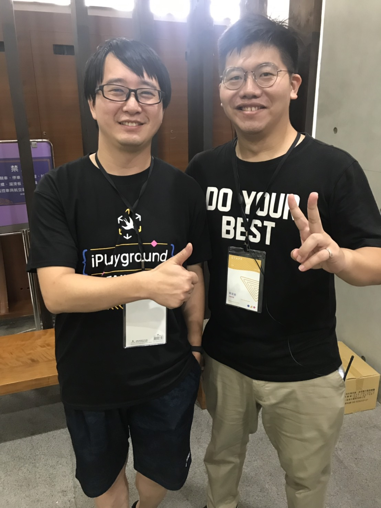

# 關於我在iPlayground19打雜那件事
大家好我是Irving，如果有參加這次iPlayground的朋友或多或少會看過我但是應該不會對我有太多印象。  
  
是的我就是這位在垃圾場處理垃圾的男子。 

第一次參加台灣的開發者大型活動就是當工作人員心情是很複雜的。 去年的iPlayground因為今年的講者大大“羊小咩”（[你的APP安全嗎?](https://twitter.com/theiPlayground/status/1169062774514712576)）的介紹知道這個活動，不過基於阮囊羞澀與那時的我還在當BIOS工程師就錯過了。
今年參加了[Cocoaheads Taipei](https://twitter.com/CocoaHeads_TPE)，在這個機緣下就參與了這一次的工作人員了。
之後先針對工作人員的部分發表一些我的感想。

## iPlayground之場務跑透透
其實當初因為對於自己也不是非常的有自信（現在當然也還是沒有），覺得自己其實啥都不會那就只好貢獻上我的膝蓋還有勞力好了。  

### 任務一 茶水&下午茶&After Party with PAPAGO
基本上在活動當天之前，是完全沒有事情要做的，本來當初要規劃PAPAGO的菜單，但是後來PAPAGO的人員就直接幫我們規劃了，然後當天PAPAGO的人也都把會場佈置得差不多了，所以原本被規劃要處理PAPAGO的事情基本上PAPAGO都自己搞定了。  
以下有些覺得需要改進的部分
1. 罐裝水  
基本上博雅館本身就具有飲水機，其實當天有相當多的人詢問飲水機的位置，並不使用罐裝水，在活動結束後的清點居然剩下到近20箱960杯水。 若是沒有強制發放的話可能水會剩的更多。另外罐裝水其實也產生相當大量的垃圾，雖然說塑膠杯可以進行回收。
2. 消耗品  
指衛生紙、紙盤、紙杯等物品。 我覺得這次的消耗品其實沒有這麼多，大家的環保意識上相當不錯，這些東西都大量的殘餘好處是PAPAGO可以協助我們回收。
3. 下午茶  
下午茶我們提供了大量的飲食，也安排了很好的取用流程，不過多數的來賓似乎沒有達到我們最初的預期交流的部分，多數人比較傾向坐在教室內吃東西，可能是因為我們缺乏一個廣大的廣場，或是可能要有個主持人來稍微主持一下。

### 任務二 垃圾回收
在這兩天因為博雅館的需求，我們花了相當多的時間在做垃圾分類，基本上外籍來賓都挺樂意進行垃圾分類，不過因為我們沒有準備多語言的告示，來賓必須要的別指導才能夠完成。
因為人潮的流動基本上是一波一波的人群出現，以博雅館的垃圾回收區其實相當的不明顯，約略有三成的人會因為趕時間等等直接垃圾亂丟，一方面也是因為博雅館針對垃圾回收的分類非常的細。
另外便當的部分備受各界肯定，不過也是因為回收的問題綜合以上整理一下建議
1. 回收分類  
我覺得對於回收的標示必須加強，其實現場會產生的垃圾類型非常固定，以這次來說最多的就是便當跟水杯，可以明確地告知來賓這個水杯要丟到哪裡。
2. 便當  
雖然邊當非常的好吃，不過在回收上面會發現便當內的分隔以及垃圾種類太多，導致再進行到回收的時候會產生排隊的人龍，可能下次會期望內部不要有錫箔紙或紙盒類等等的東西，讓人可以直接翻倒就倒完。

### 任務三 機動服務
基本上這沒什麼好說就是大家需要做什麼就去做什麼，請抱持服務的熱忱有雜事就去做就對了。

## 結論
突然就結論了，其實身為工作人員就是會有不少的議題會看不到，不過好處就在於可以跟很多大神們合照(!?)  
  

也可以努力的認識許多的開發者，跟比較有經驗的開發者聊天，真的可以獲得取多的幫助，不亞於聽一些很有用的演講。
基本上還是有辦法定期找到時間去聽一些演講，以我的情況我聽了兩場Keynote跟一個workshop還有一個議題。 
雖然大概還是錯過了八成的演講，不過其實這次的分享許多都非常有用，而且有留下了豐富的筆記，事後回家也是有非常多的東西要讀。

以上
